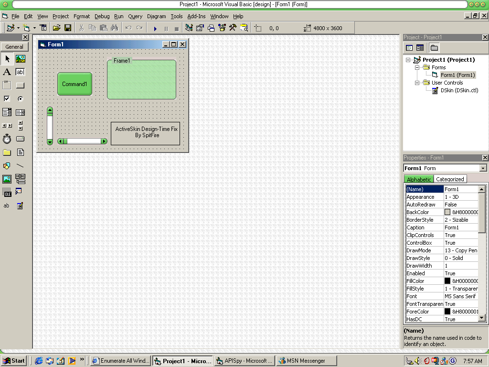



## View your activeskin skins at design time

### Description

With this you can view your ActiveSkin skins while your editing it! In case you dont have ActiveSkin, ive included the OCX which you have to rename from OC_ to OCX. Look at the screenshot. Oh and i included 1 skin.
 
### More Info
 

             |
---                |---
**Submitted On**   |2003-08-02 08:00:18
**By**             |[Jesse Seidel \(Dr\. Fire\)](https://github.com/Planet-Source-Code/PSCIndex/blob/master/ByAuthor/jesse-seidel-dr-fire.md)
**Level**          |Beginner
**User Rating**    |5.0 (15 globes from 3 users)
**Compatibility**  |VB 6\.0
**Category**       |[Custom Controls/ Forms/  Menus](https://github.com/Planet-Source-Code/PSCIndex/blob/master/ByCategory/custom-controls-forms-menus__1-4.md)
**World**          |[Visual Basic](https://github.com/Planet-Source-Code/PSCIndex/blob/master/ByWorld/visual-basic.md)
**Archive File**   |[View\_your\_162341822003\.zip](https://github.com/Planet-Source-Code/jesse-seidel-dr-fire-view-your-activeskin-skins-at-design-time__1-47350/archive/master.zip)

